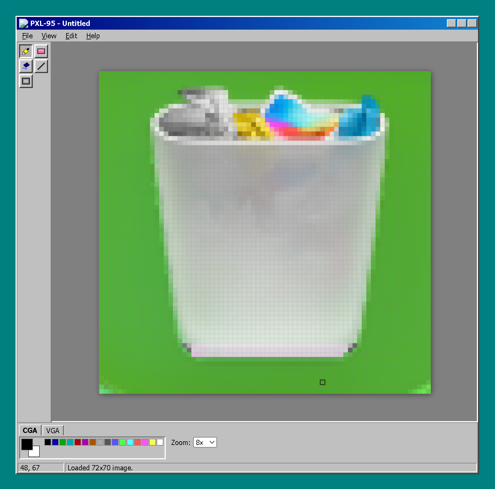

# 🖌️ PXL-95: Retro Pixel Editor

## 📺 See it in action

**PXL-95** is a lightweight, web-based pixel art editor inspired by the classic Windows 95 era and ZSoft's *PC Paintbrush*. It focuses on pure, grid-based pixel manipulation with a nostalgic "gray-box" aesthetic.

---

## ✨ Features

- **Dual-Layer Canvas**: Crystal-clear pixel rendering on the bottom layer with a dynamic UI overlay (grid/cursor) on the top.
- **Classic Toolset**:
  - ✏️ **Pen**: Fine-grained pixel editing.
  - 🧼 **Eraser**: Transparency-aware erasing.
  - 🪣 **Flood Fill**: Efficient stack-based seed fill for large areas.
  - 📏 **Line Tool**: Bresenham’s algorithm for perfect pixel diagonals.
- **Retro Palettes**: Toggle between the iconic **16-color CGA** and **256-color VGA** palettes.
- **Precision Zoom**: Work at 1x scale or zoom up to 32x. A pixel grid automatically appears at zoom levels > 4x.
- **Auto-Persistence**: Your artwork is automatically saved to your browser's local storage—it survives refreshes and crashes.
- **PNG Export**: Save your creations as high-quality PNG files.

---

## 💾 Installation (PWA)

PXL-95 is a **Progressive Web App**, meaning you can install it directly onto your desktop or mobile device and use it **completely offline**.

### On Desktop (Chrome/Edge):
1. Navigate to the PXL-95 URL.
2. Look for the **"Install" icon** (a small computer screen with an arrow) in the right side of the address bar.
3. Click **Install**. PXL-95 will now appear in your applications list and run in its own window without browser tabs.

### On Mobile (iOS/Safari):
1. Open the URL in Safari.
2. Tap the **Share** button (square with an up arrow).
3. Scroll down and tap **"Add to Home Screen."**

---

## 🚀 How to Use

### Basic Interaction
- **Left Click**: Paint with your **Primary Color**.
- **Right Click**: Paint with your **Secondary Color** (or pick colors from the palette).
- **Tool Switching**: Click the icons on the left toolbar or use the Status Bar to confirm your active tool.

### Managing Colors
- The **Palette** is located at the bottom.
- **Left Click** a swatch to set your Primary Color.
- **Right Click** a swatch to set your Secondary Color.
- Switch between **CGA** and **VGA** tabs for different color sets.

### File Actions
- **Menu Bar**: Click **File** to clear the canvas.
- **Export**: Click the **Export** button in the menu bar to download your work as a `.png`.

---

## 🛠️ Tech Stack
- **HTML5 Canvas API** (Layered architecture)
- **Vanilla ES6+ JavaScript** (No frameworks)
- **CSS Flexbox & Grid** (Retro Win95 Design System)
- **Service Workers** (For offline support)

---

*“It's not just an editor; it's 1995 again.”*
